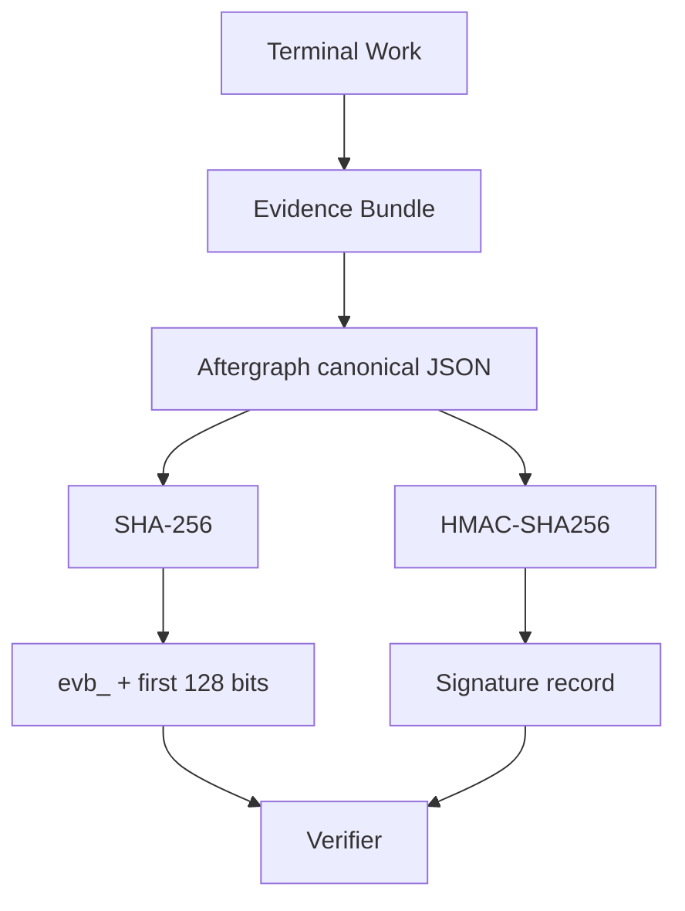
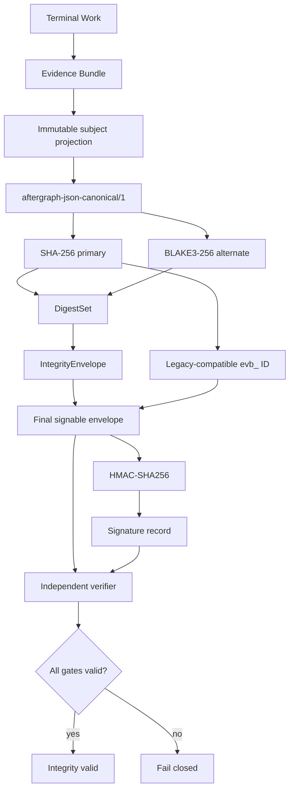

# Integrity Fabric v1

Status: implementation candidate in PR #143. Promotion requires green tests, controlled-host benchmark evidence, merge, and post-merge verification.

## Purpose

Move evidence identity from a SHA-256-only implementation detail to an algorithm-agile integrity contract while preserving the existing `bundle_id` and N-1 readers.

A digest proves byte identity. It does **not** prove actor identity, authority, provenance, or verified outcome; those remain separate evidence/signature/verifier responsibilities.

## Before

### Before modules

| Module | Before |
|---|---|
| Content identity | Implicit SHA-256 |
| Bundle ID | `evb_` + 32 hex chars from SHA-256 |
| Digest metadata | None |
| Digest scope | Implicit |
| Alternate digest | None |
| Large-object/tree-ready scope | None |
| Canonicalization binding | Comment/code convention |
| Signature | HMAC-SHA256 over canonical projection |
| Compatibility | SHA-256 only |
| Performance evidence | No dedicated digest benchmark |

## After

### After modules

| Module | After |
|---|---|
| `DigestAlgorithm` | Explicit `sha256` / `blake3` |
| `DigestScope` | `raw-bytes`, `canonical-object`, `merkle-root` |
| `DigestRef` | Algorithm + scope + encoding + value |
| `DigestSet` | SHA-256 primary + alternate digests |
| `IntegrityEnvelope` | Canonicalization + subject scope + DigestSet |
| Bundle ID | Existing SHA-256-derived `evb_` contract preserved |
| Signature | Covers the final envelope including Integrity metadata |
| Verifier | Validates bundle ID + every digest + signature + correlation |
| Compatibility | N-1 bundles without Integrity remain readable |
| Performance evidence | Controlled self-hosted benchmark in Aftergraph CI |

## Invariants

1. `bundle_id` remains SHA-256-derived for interoperability.
2. Every digest declares its algorithm, encoding, and semantic scope.
3. All members of a DigestSet hash the exact same subject bytes and scope.
4. Integrity metadata and signatures are excluded from the subject digest to prevent self-reference.
5. The final signature authenticates the IntegrityEnvelope.
6. A present IntegrityEnvelope is fail-closed: any malformed/missing required BLAKE3 alternate or mismatch invalidates verification.
7. Legacy bundles without Integrity remain N-1 compatible.
8. Digest validity never upgrades execution success to verified outcome.

## Performance comparison protocol

Benchmarks execute on the Aftergraph self-hosted Linux/x64 runner with the same process, payload, Go toolchain, and host for each path.

Measured sizes:

- 1 KiB
- 1 MiB
- 16 MiB

Compared paths:

- **Before:** SHA-256 only
- **Native alternate:** BLAKE3 only
- **After:** DigestSet = SHA-256 + BLAKE3

Metrics:

- ns/op
- MB/s
- B/op
- allocs/op
- dual-digest overhead vs SHA-256-only
- BLAKE3 throughput multiplier vs SHA-256

Raw benchmark output is uploaded as a CI artifact. Results are not promoted into this document until produced by the controlled host.

## Rollout

No live/deployment claim is made before the final post-merge verification.
