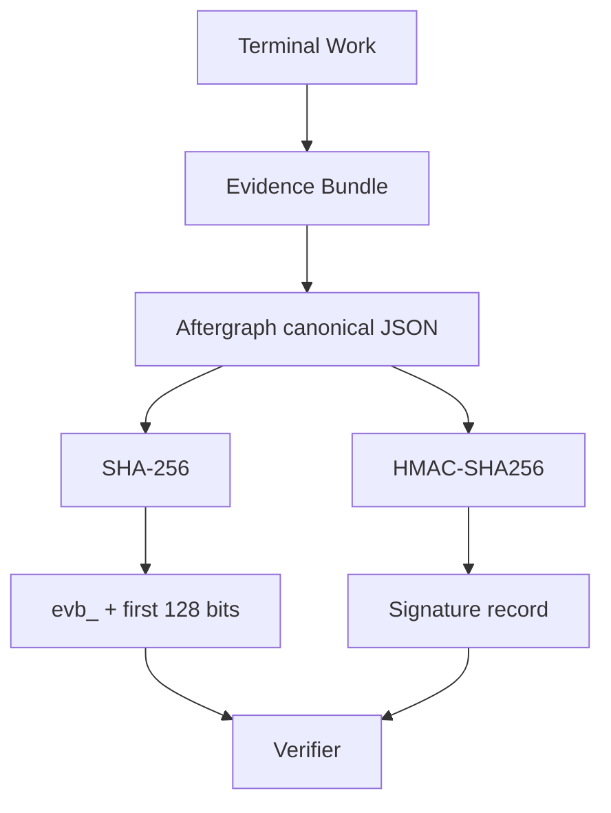
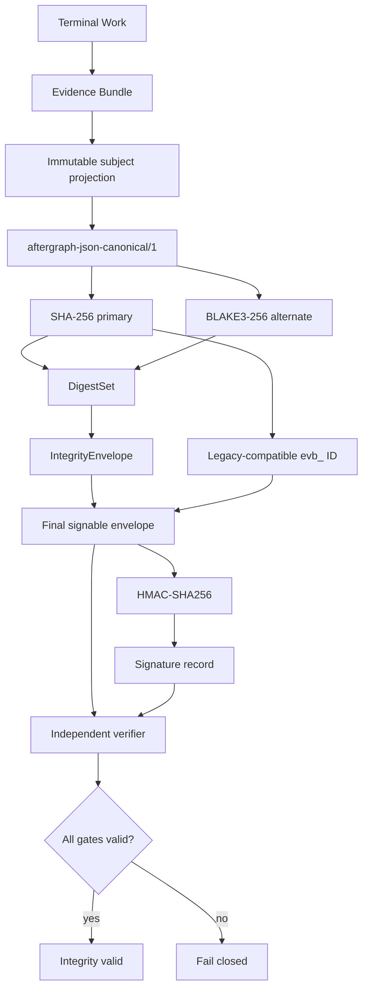
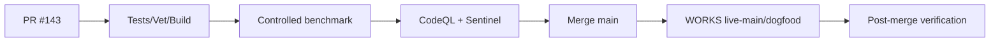

# Integrity Fabric v1

Status: merged to `main` at `2d0e2186a438d9eaf88916c1bb2acb4d2a8991ce`. GitHub build/vet/test, CodeQL, Sentinel, Scorecard, release-drafter, and dependency-graph checks are green on the merged SHA. WORKS-native dogfood for that SHA reported failure as `wrk_3cb5496c83a4e87f4a8a9e7baf8d9832`; production-live promotion remains blocked until that native execution failure is resolved and the deployed runtime is verified.

## Purpose

Move evidence identity from a SHA-256-only implementation detail to an algorithm-agile integrity contract while preserving the existing `bundle_id` and N-1 readers.

A digest proves byte identity. It does **not** prove actor identity, authority, provenance, or verified outcome; those remain separate evidence/signature/verifier responsibilities.

## Before

### Before modules

| Module | Before |
|---|---|
| Content identity | Implicit SHA-256 |
| Bundle ID | `evb_` + 32 hex chars from SHA-256 |
| Digest metadata | None |
| Digest scope | Implicit |
| Alternate digest | None |
| Large-object/tree-ready scope | None |
| Canonicalization binding | Comment/code convention |
| Signature | HMAC-SHA256 over canonical projection |
| Compatibility | SHA-256 only |
| Performance evidence | No dedicated digest benchmark |

## After

### After modules

| Module | After |
|---|---|
| `DigestAlgorithm` | Explicit `sha256` / `blake3` |
| `DigestScope` | `raw-bytes`, `canonical-object`, `merkle-root` |
| `DigestRef` | Algorithm + scope + encoding + value |
| `DigestSet` | SHA-256 primary + alternate digests |
| `IntegrityEnvelope` | Canonicalization + subject scope + DigestSet |
| Bundle ID | Existing SHA-256-derived `evb_` contract preserved |
| Signature | Covers the final envelope including Integrity metadata |
| Verifier | Validates bundle ID + every digest + signature + correlation |
| Compatibility | N-1 bundles without Integrity remain readable |
| Performance evidence | Same-run comparative benchmark in canonical Go CI + WORKS-native post-merge gate |

## Invariants

1. `bundle_id` remains SHA-256-derived for interoperability.
2. Every digest declares its algorithm, encoding, and semantic scope.
3. All members of a DigestSet hash the exact same subject bytes and scope.
4. Integrity metadata and signatures are excluded from the subject digest to prevent self-reference.
5. The final signature authenticates the IntegrityEnvelope.
6. A present IntegrityEnvelope is fail-closed: any malformed/missing required BLAKE3 alternate or mismatch invalidates verification.
7. Legacy bundles without Integrity remain N-1 compatible.
8. Digest validity never upgrades execution success to verified outcome.

## Performance comparison protocol

PR benchmarks execute as same-run comparative evidence on one Linux/x64 GitHub Actions host. Final promotion still requires WORKS-native main-branch dogfood and post-merge runtime verification; hosted-runner timings are comparative evidence, not production-performance evidence.

Measured sizes:

- 1 KiB
- 1 MiB
- 16 MiB

Compared paths:

- **Before:** SHA-256 only
- **Native alternate:** BLAKE3 only
- **After:** DigestSet = SHA-256 + BLAKE3

Metrics:

- ns/op
- MB/s
- B/op
- allocs/op
- dual-digest overhead vs SHA-256-only
- BLAKE3 throughput multiplier vs SHA-256

### Measured merged-main result

Exact merged SHA: `2d0e2186a438d9eaf88916c1bb2acb4d2a8991ce`  
GitHub Actions: Go tests push run `36108403783` PASS; CodeQL, Sentinel gate, OpenSSF Scorecard, Release Drafter, and configured dependency-graph update PASS on the same SHA.  
Benchmark host: Linux/x64, 4 vCPU, Intel Xeon Platinum 8573C, Go 1.25.0. Five samples per case; values below use the median.

| Path | Before / reference | After / alternate | Change |
|---|---:|---:|---:|
| Full 64 KiB evidence integrity pipeline | 540,901 ns/op | 576,501 ns/op | **+6.58% latency** |
| Full pipeline bytes allocated | 239,552 B/op | 249,489 B/op | **+4.15%** |
| Full pipeline allocations | 359 allocs/op | 492 allocs/op | +37.0% |
| 1 MiB SHA-256 | 634,636 ns/op | — | baseline |
| 1 MiB BLAKE3 | — | 300,491 ns/op | **2.11× faster** than SHA-256 |
| 16 MiB SHA-256 | 10,165,212 ns/op | — | baseline |
| 16 MiB BLAKE3 | — | 4,970,631 ns/op | **2.05× faster** than SHA-256 |
| 16 MiB dual DigestSet | 10,165,212 ns/op SHA-only | 15,152,716 ns/op | **+49.07%** hashing cost for two digests |

Interpretation: two digests necessarily add raw hashing work, but the evidence pipeline is dominated by canonicalization/serialization. The first implementation attempt re-canonicalized the whole bundle twice and measured roughly +90% end-to-end latency; the final domain-separated streaming HMAC framing reduced the merged-main end-to-end overhead to **+6.58%**.

The 1 KiB microbenchmark still shows higher fixed BLAKE3 overhead than SHA-256 on this host, so no tiny-payload speedup is claimed.

### Native promotion status

- GitHub exact-SHA gates: **PASS**
- Merge queue: **PASS / merged**
- WORKS native dogfood for exact merged SHA: **FAIL**
- Native Work ID: `wrk_3cb5496c83a4e87f4a8a9e7baf8d9832`
- Root-cause evidence: not yet retrievable from the loopback-only production WORKS API in this session
- Production deployment / live runtime verification: **NOT YET CLAIMED**

The failed native gate is intentionally retained as evidence rather than hidden behind the green hosted checks.

## Rollout

No live/deployment claim is made before the final post-merge verification.
